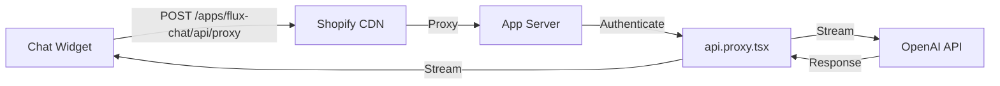

# FluxChat AI Assistant - Documentation

## 🎉 Overview

FluxChat is a Shopify-native AI chat assistant that helps customers find products, get recommendations, and make purchases directly through an embedded chat interface. The widget successfully implements:

- ✅ **Streaming AI responses** using OpenAI GPT-4
- ✅ **Shopify App Proxy** for secure API communication
- ✅ **Theme App Extension** for storefront integration
- ✅ **Real-time chat interface** with modern UI

## 📁 Project Structure

```
flux-chat-shopify/
├── app/                          # Remix Shopify app (admin & backend)
│   ├── routes/
│   │   ├── app._index.tsx       # Admin dashboard
│   │   ├── api.chat.tsx        # Direct API endpoint (with CORS)
│   │   └── api.proxy.tsx       # Shopify App Proxy endpoint
│   ├── lib/
│   │   ├── ai.server.ts        # AI configuration (OpenAI/Anthropic)
│   │   └── config.server.ts    # Environment configuration
│   └── shopify.server.ts       # Shopify authentication
│
├── extensions/
│   └── chat-widget/             # Theme app extension
│       ├── blocks/
│       │   └── chat-widget.liquid  # App embed block
│       └── assets/
│           ├── chat-widget.js      # Widget JavaScript
│           └── chat-widget.css     # Widget styles
│
├── scripts/
│   └── update-ngrok.js         # Helper to update ngrok URLs
│
├── .env                         # Environment variables
└── shopify.app.toml            # Shopify app configuration
```

## 🚀 Current Implementation Status

### ✅ Completed Features

1. **Chat Widget UI**
   - Floating chat button with open/close functionality
   - Message display with user/AI distinction
   - Real-time message streaming
   - Professional dark theme styling

2. **AI Integration**
   - OpenAI GPT-4 integration via Vercel AI SDK
   - Streaming responses for better UX
   - Conversation context management

3. **Shopify Integration**
   - App Proxy configuration for secure API calls
   - Theme App Extension with app embed
   - CORS-free communication through proxy
   - ngrok tunneling for development

### 🚧 In Progress / Next Steps

1. **Product Integration**
   - [ ] Fetch real products from Shopify
   - [ ] Display product cards in chat
   - [ ] Add-to-cart functionality

2. **Enhanced Features**
   - [ ] Persistent chat history
   - [ ] Multiple theme options
   - [ ] Mobile responsiveness improvements
   - [ ] Typing indicators

3. **Admin Dashboard**
   - [ ] Chat analytics
   - [ ] AI behavior customization
   - [ ] Store-specific settings

## 📚 Technical Architecture

### API Flow



### Key Components

#### 1. **Chat Widget** (`extensions/chat-widget/assets/chat-widget.js`)
- Vanilla JavaScript implementation
- Handles UI interactions
- Manages streaming responses
- Includes ngrok skip header for development

#### 2. **App Proxy Route** (`app/routes/api.proxy.tsx`)
- Authenticates requests via Shopify
- Processes chat messages
- Returns streaming AI responses
- No CORS issues (same-origin via proxy)

#### 3. **AI Configuration** (`app/lib/ai.server.ts`)
- Configures OpenAI model (GPT-4-mini)
- Defines system prompt
- Manages AI behavior

## 🔧 Development Setup

### Environment Variables

```env
# Ngrok URL (update when restarting ngrok)
NGROK_URL=https://your-url.ngrok-free.app
SHOPIFY_APP_URL=https://your-url.ngrok-free.app

# AI Service
OPENAI_API_KEY=your-api-key

# Database
DATABASE_URL=your-database-url
```

### Quick Commands

```bash
# Start development server
shopify app dev --tunnel-url https://your-url.ngrok-free.app

# Update ngrok URL across the app
bun run update-ngrok https://new-url.ngrok-free.app

# Deploy changes
bun run deploy
```

## 🐛 Troubleshooting

### Common Issues & Solutions

1. **CORS Errors**
   - ✅ Solved by using App Proxy instead of direct API calls
   - Widget calls `/apps/flux-chat/api/proxy` (same-origin)

2. **ngrok URL Changes**
   - Use `bun run update-ngrok` to update all references
   - Deletes cached `.shopify/dev-bundle` automatically

3. **Import Errors**
   - Changed `~/lib/...` imports to relative paths `../lib/...`
   - Vite had issues with `~` alias in proxy routes

4. **Widget Not Appearing**
   - Check app embed is enabled in theme editor
   - Verify initialization in browser console
   - Clear browser cache if needed

## 📝 Next Development Phase

With the core chat functionality working, the next phase will focus on:

1. **Product Integration**
   - Implement product search API
   - Create product card components
   - Add cart integration

2. **User Experience**
   - Add loading states
   - Implement error handling
   - Improve mobile responsiveness

3. **Store Customization**
   - Per-store AI personality settings
   - Custom prompts and behaviors
   - Branding options

---

*Last Updated: September 2025*
*Status: Core Chat Functionality Complete ✅*